CMP201 Coursework - Bathymetry Pathfinding Algorithms
=====================================================

> | Disclaimer: | This is the coursework that was sumitted for an assessment, feel free to be inspired or get in touch with me about the code base. Please do not plaigarise as you'll likely get caught which is not a good look for anyone. |
> |-------------|:--------------------|

> ```
> Author - Joseph Lee
> Date - 20/12/2020
> Project Name - Bathymetry Pathfinding Algorithms
> ```

> If you have any questions about this project then [contact me](mailto:1903399@uad.ac.uk?subject=[Github]%20-%20Bathymetry%20Pathfinding%20Algorithm%20Contact) and I would be happy to answer any queries.  


Introduction
------------
### Overview
This project is for completion of my coursework for the CMP201 - 
[Data Structures and Algorithms 1](https://modules.abertay.ac.uk/module.cfm?modcode=CMP201&term=S1)
module. 

### Coursework Aims
The assessment criteria outlines that the application made for this project had to meet the below
criteria:
* Implement two different standard algorithms that solve the same real-world problem
* Make use of appropriate data structures for the application's needs
* Allow you to compare the performance of the two algorithms as you vary the size of the input data.

### Chosen Application
Due to my involvment in the tidal energy sector and recent project work I have been exposed to a 
common problem when routing subsea cables over sections of seabed, this is that there are very few
avaliable tools to assist this process. I have been keen to look into developing a tool for this 
purpose for some time and this coursework felt like the perfect platform to compare potential 
pathfinding algorithms that might be used with this tool.

The aim of this project will be to compare the performance and results of two pathfinding algorithms
(`Lee` and `A*`) when finding the shortest and smoothest route between two points in a given set of
bathymetry data for potential use in a tool for subsea cable routing. As an added additional comparison
and to confirm the correct heuristic weighting for the `A*` algorithm is will be compared to `Dijkstra's`.

### Real World Need
It is a common issue in the offshore tidal energy industry to need to optimise subsea
cable routes between offshore tidal energy platforms and the shore to allow the export
for the generated electrical power. Although the shortest possible cable length is 
advantagious it is not the only factor. Due to the cable felixibility the
topology of the seabed often needs to be considered and the smoothest route between two points
to increase the cable stability on the seabed and reduce cable fatigue that is often caused by
having suspended cable over seabed ridges.

### Smoothness
To allow for the smoothest route to betweem the start position and the end position to be 
selected the bathy data will be represented as a grid. Each Node in the grid will be 
assigned a `depth` value. This depth will be used to calcuate the cost for moving to this
cell, in this case this is the difference in depth between the two nodes.

Results
-------
### Input Data
The primary input data for this application is seabed bathymetry data. This data is a representation
of the seawater depth at regular intervals forming a grid of depth data. This data is then often used 
to make 2D or 3D representation of the seabed data. Below is an example of some bathymetry data being
used to create a 3D representation of the seabed. 

<center>

| Example of Some 3D Bathymetry Data  |
|:-----------------------------------:|
| 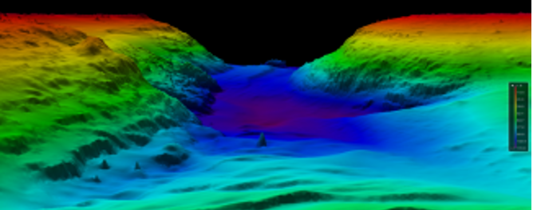        |
| National Centers for Environmental Information (2020). [Available](https://www.ncei.noaa.gov/sites/default/files/styles/max_325x325/public/sites/default/files/bathymetry-image-1200x480.png?itok=82IoqMAs) |

</center>

The data set for used as an example in this application was taken from the publically avaliable 
[Admiralty Marine Data Portal](https://datahub.admiralty.co.uk/portal/apps/webappviewer/index.html) where it
is possible to download maine datasets held by the UKHO (UK Hydrographic Office) for areas within the UK EEZ
(Exclusive Economic Zone). This indluces bathymetry, ship routing, wrecks and maritime limits. It is an excellent
resource for this type of project. 

Due to the easy access to this data, UK based bathymetry data was chosen for this project. Due to my personal 
familirity with the Connel from my involvement in the [PLAT-I 4.63 at Connel Project](https://www.youtube.com/watch?v=LhvCzHbWy0g)
where the option for a subsea export cable was considered. The exact data set used for the this example is the
bathymetry data from `2014 HI1441 Loch Etive 2m SDTP` which can be downloaded [here](https://datahub.admiralty.co.uk/Bathy_Data/Prodbathy/Bathymetry/2014%20HI1441%20Loch%20Etive%202m%20SDTP.bag)

This data is provided in the `ROS Bag` (.bag) format, this is not the easiest format to parse and outside the scope
of the this project. Parsing this common format of this data would be a good future project. For this project this 
data was processed using [Global Mapper](https://www.bluemarblegeo.com/global-mapper/) to export a sample of this data
into the easier to parse `.csv` data. The area selected as an example is shown below and is a section across the entire
width of the river to give some interesting routing options.

<center>

|      Example Data Set Location                                                                                                                                                     |
|:----------------------------------------------------------------------------------------------------------------------------------------------------------------------------------:|
| 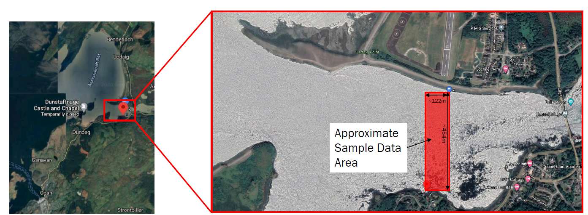                                                                                                                                               |
| Google Maps(2020). [Available](https://www.google.com/maps?q=google+maps+connel&rlz=1C1CHBF_en-GBGB792GB792&um=1&ie=UTF-&sa=X&ved=2ahUKEwjwgp3Bs4DuAhXIh1wKHSG-AGAQ_AUoAXoECAYQAw) |

</center>

Once this data was exported in the correct format it was noted that the data was not *rectangular* which would
mean that there is a risk of `null` vaules being included in the dataset. Handling this type of data was deemed
outside the scope of this project and would be an issued that needs addressing in any futre projects. To resolve
this issue and ensure *rectangular* dataset it was trimmed as below to ensure the data could be stored in a regular
grid.

<center>

|      Example Data Set Trimming       |
|--------------------------------------|
| 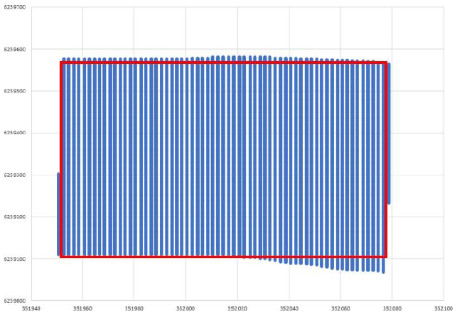 |

</center>

Below is an example of the example data sets `ConnelBathyDataTiny.csv` the full data set and 
`ConnelBathyDataTinyTrimmed.csv` the trimmed dataset. Which are both included in the `Data/` 
directory. These contour plots were produced using the [Pyhton Bathy Plotter Tool](#bathy-plotter) 
incluced in the `PythonScripts/` directory.

<center>
 
|          Example Data Set Full       |          Example Data Set Trimmed       |
|--------------------------------------|-----------------------------------------|
| 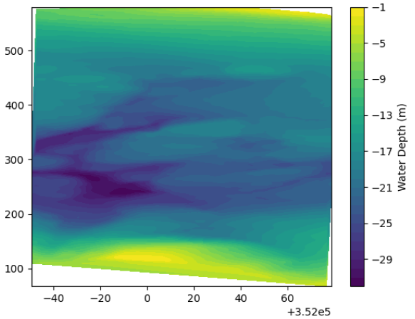 | 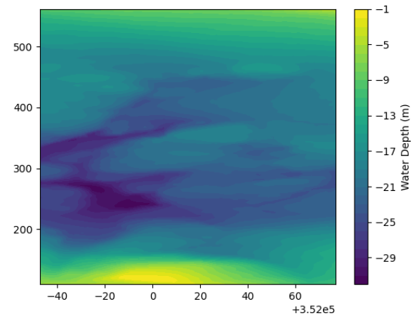 |

</center>

### Output Data
This section presents the output data from the application and presents both the paths
shown in <span style='color:red'>RED</span> and visited nodes show in 
<span style='color:magenta'>PINK</span> overlaid on the bathymetry plots. This can be used
to subjectivly assess if the algorithm correctly finding a path and how it is searching for
this path.

#### Lee Algorithm
This section presents to outputs for the two paths used for testing using the `Lee` algorithm
and provides some comments on these results.

##### Path 1
Below are the path shown in <span style='color:red'>RED</span> and visited nodes show in 
<span style='color:magenta'>PINK</span> for the Lee algorithm overlaid on the bathymetry plots.

<center>

|       Lee Algorithm Path        |     Lee Algorithm Nodes Visited    |
| --------------------------------|------------------------------------|
| 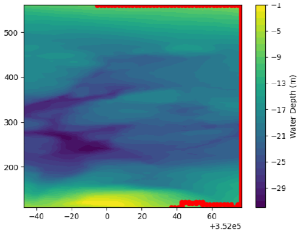 | 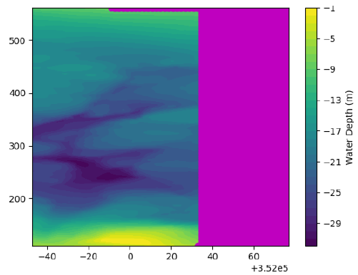 |

</center>

Looking at these results it can be seen that the algorithm has found a path beween the two points
however, it seems to have hugged the boundary while doining this. Looking at the searched area it 
can also be seen that it has stopped searching as soon as it has found the end point node. Which 
means that it has not searched the entire area. This means that the path shown is not guaranteed
to be the shortest path. In any furtre itertation using this algorithm the algorithm would need to 
be modified to search the entire area before selecting path.

##### Path 2
Below are the path shown in <span style='color:red'>RED</span> and visited nodes show in 
<span style='color:magenta'>PINK</span> for the Lee algorithm overlaid on the bathymetry plots.

<center>

|       Lee Algorithm Path        |     Lee Algorithm Nodes Visited    |
| --------------------------------|------------------------------------|
| 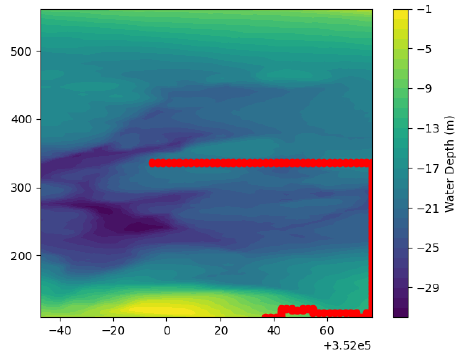 | 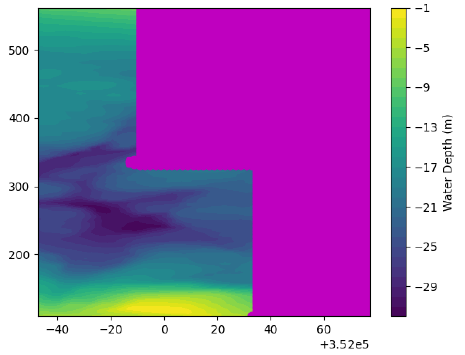 |

</center>

Similar to path 1, the algorithm did find a path between the two points and as the start and end points
required the algorithm to search more of the area it was a more accurate path than peviously. However, due
to the same issue where the search stops as soon as it finds the end point the best path was not found. 


#### A* Algorithm
This section presents the output data from the application and presents both the paths
shown in <span style='color:red'>RED</span> and visited nodes show in 
<span style='color:magenta'>PINK</span> overlaid on the bathymetry plots. This can be used
to subjectivly assess if the algorithm correctly finding a path and how it is searching for
this path.

##### Path 1
Below are the path shown in <span style='color:red'>RED</span> and visited nodes show in 
<span style='color:magenta'>PINK</span> for the A* algorithm overlaid on the bathymetry plots.

<center>

|          A* Algorithm Path         |        A* Algorithm Nodes Visited     |
| -----------------------------------|---------------------------------------|
| 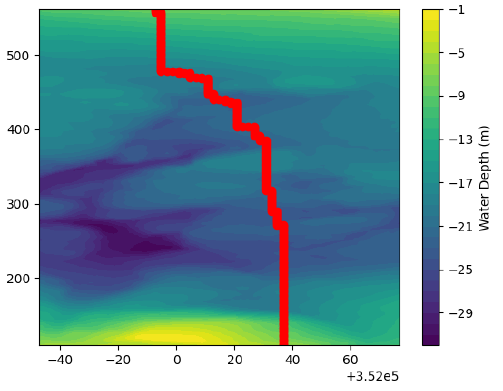 | 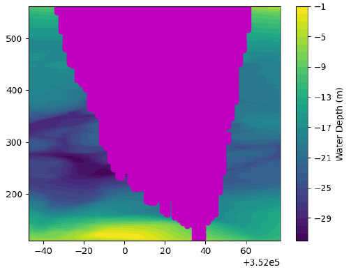 |

</center>

Form examining the plots it can be seen that the algorithm sucessfully found a path between the two
points. Comparing this the the Lee algorithm path it is more intuative as it is clearly shorter and
assessing the route visually it looks to be following a *smooth* route. Looking at the visitied nodes
it is clear that the heuristics are working an narrowing down the search to the nodes relevant, while
still optimizing to the best avaliable route. 

##### Path 2
Below are the path shown in <span style='color:red'>RED</span> and visited nodes show in 
<span style='color:magenta'>PINK</span> for the A* algorithm overlaid on the bathymetry plots.

<center>

|          A* Algorithm Path         |        A* Algorithm Nodes Visited     |
| -----------------------------------|---------------------------------------|
| 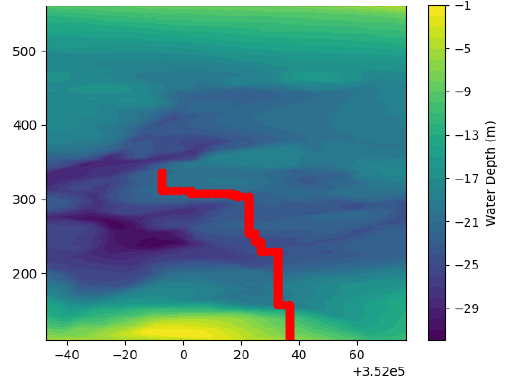 | 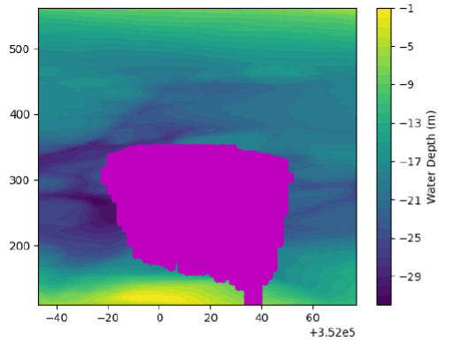 |

</center>

Similar to path 1, it is clear that the heuristics are working on the algorithm limiting the search 
area to the relevant nodes. It has also successfully found a path between the two points.

#### Dijkstra's Algorithm
Dijkstra's algorithm is effectively an A* algorithm without the heuritics, so it has to search the
entire search space before determining the best path. Because of this it made sense to compare the 
output from Dijkstra's to that of the A* to confirm that the heuristic weighting used in the A* was 
not having adverse effects on the results. The two outputs should be identical or very similar.

Below are the path shown in <span style='color:red'>RED</span> and visited nodes show in 
<span style='color:magenta'>PINK</span> for the Dijkstra's algorithm overlaid on the bathymetry plots.

<center>

|        Dijkstra's Algorithm Path     |      Dijktra's Algorithm Nodes Visited  |
| -------------------------------------|-----------------------------------------|
| 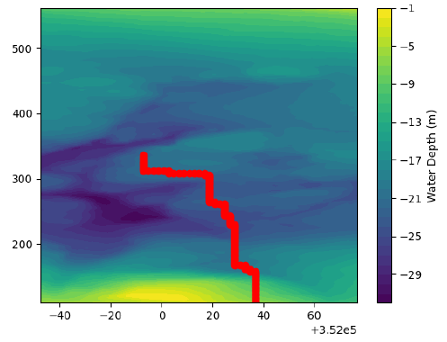 | 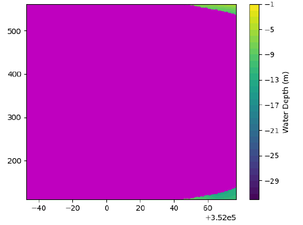 |

</center>

Looking at these outputs it is clear that Dijkstra's has searched the entire search area (except the bits that
were <1m in depth). Comparing the path selected to the one from the A* algorithm it is extremely similar. The only 
noticable difference is right at the start of the path, where there are some very small differences. This is likely 
caused by the weighting being slightly too high in the A* algorithm. The difference between the routes is shown below, 
the main area of interest is show in the <span style='color:orange'>ORANGE</span> dashed rectangle:

<center>

|              A* Path 2                  |             Dijktra's Path 2              |
| ----------------------------------------|-------------------------------------------|
| 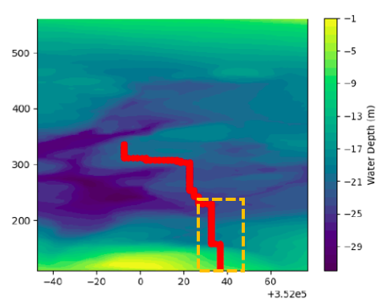 | 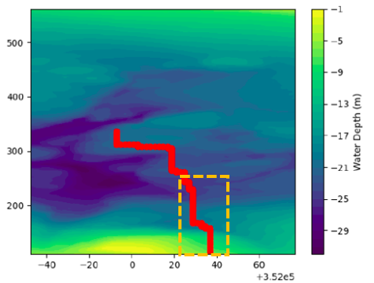 |

</center>


### Performance
The performance of each of the altgorithms was measured for both of the two paths using the same data set. The metric
used to compare the performance of each of the algorithms was algorithm execution time. This timing only covered the 
path finding algorithm section of the code so excludes any of the data reading or writing. 

To ensure that the results were as accurate as possible the below steps were taken during the performance measurement:
* All of the final results presented have been collected over 1000 executions of the code and the **median** values used, to account for 
potential non-normal distribution of data.
* All other programmes running on the test machine were closed where possible and kept the same in the case they needed to be left running.
* The start point, end point and data set were kept the same for each comparison run, to allow direct comparison.
* All debug code was disabled from the pathfinding functions before performance tests and a release compiliation used.
* The `std::chrono::steady_clock` was used for the timing as it uses **monotonic time**, this ensures that time intervals are constant 
and not reliant on the system clock which can be inflenced by system load.

Below are the box-plots of the performance data collected for each of the algorithms for each of the two paths. The median values
for each of the algorithms is shown below the relevant box-plot in square brackets `[]`.

<center>

|                Path 1                    |                Path 2                     |
|:----------------------------------------:|:-----------------------------------------:|
| 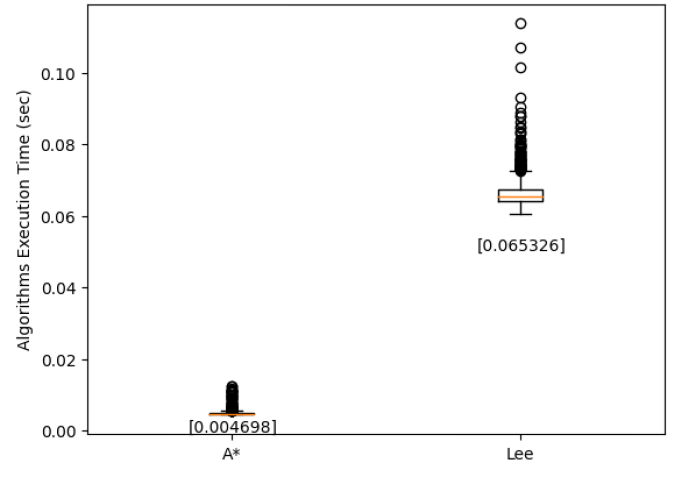   | 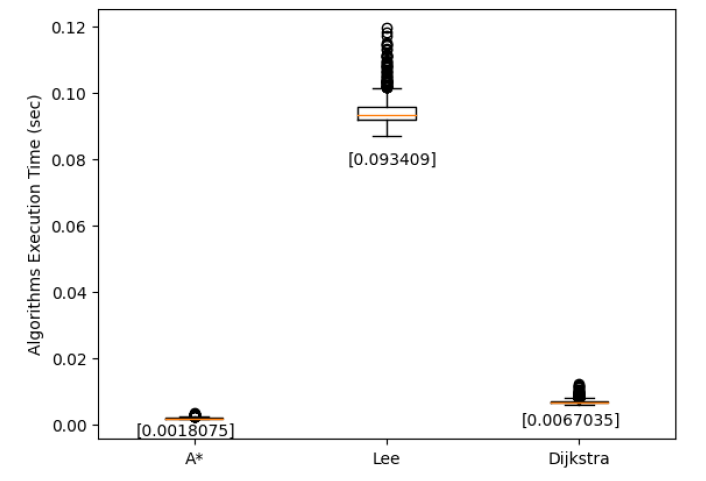    |
| P-value < 0.0001 calculated using T-test | P-value < 0.0001 calculated using T-test  |

</center>

First, reviewing the performance results of both the Lee and A* algorithms for path 1, is can be 
seen that the A* algorithm has a significantly faster execution time than the Lee alorithm with
the median value for A* being **0.004698** sec and **0.065326** sec for the Lee algorithm. From 
inspecting the box-plot it is also clear that the execution time is much more consistent with the 
A* algorithm with a much tighter grouping of times then the Lee algorithm.

Reviewing the performance for all three algorithms for path 2 it is again clear that the A* algorithm 
executes the fastest, with the most consistent executions speed. Followed by Dijkstra's then the Lee 
algorithm being the slowest. Below is a summary of the median execution times compared against the A*
value, which was the fastest in both cases.

<center>

| Algorithm  |    Path 1    | Path 1 Increase Over A* |     Path 2    | Path 2 Increase Over A* |
|------------|:------------:|:-----------------------:|:-------------:|:-----------------------:|
|     A*     | 0.004698 sec |                         | 0.0018075 sec |                         |
|    Lee     | 0.065326 sec |         1290.51%        | 0.0934090 sec |         5067.86%        |
| Dijkstra's |              |                         | 0.0067035 sec |         270.871%        | 

</center>

Another performance test that was conducted was to measure the performace as the data set size changed
this was done using the additional data sets in the `Data/` directory. The additional data sets used for 
comparison were `ConnelBathyDataSampleTinyTrimmedHalf.csv` and `ConnelBathyDataSampleTinyTrimmedQuarter.csv`
along with the full trimmed data set `ConnelBathyDataSampleTinyTrimmed.csv`. These were used to plot the data
points shown below are the **median** values taken after 1000 runs as per previous measurements.

<center>

| Comparison of Algorithm Performace as Data Set Varies in Size |
|---------------------------------------------------------------|
|        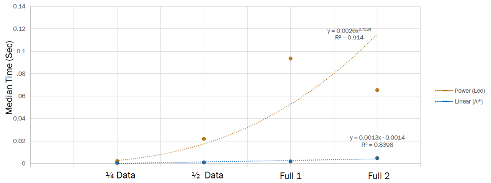             |

</center>

Looking at the two plotted lines above it can be determined that the implementation of teh A* algorithm is close
to its best case complexity of **O(N)** based on the linear plot. Where the Lee algorithm is harder to confirm 
the exact complexity as its expected complexity shold be **O(NM)** but this implementaion seems to perform slightly
worse than this. Particuarly in path 2, this is due to the start and end points requireing more of the search area
to be checked, this can be seen by the large difference between Path 1 (Full 1) and Path 2 (Full 2).

### Conclusion
Based on the results collected in the project it can be determined that the A* algorithm performs the best out of the 
three algorithms tested. It would be my recommendation that any furture projects look to implement the A* algorithm into
any subsea pathfinding bathymetry tools. 

This implementation of the A* algorithm was close to the best case complexity of **O(N)** and when compared to Dijkstra's
algorithms produces a very similar path. The variation in path indicate that the heuristic weighting used by the A* algorithm
needs so further adjustment to ensure that it guarantees the shortest path in all cases. 

### Reflection Points
The implementation of this project highlighted several points to refelct on. They are summaraized below:
* Lee algorithm search - The fact that this implementation of the Lee algorithm terminated its search as soon as the end point is
reached meant that the path's found often where not the optimum. However, ensuring the entire search area is search would make the 
performance even worse. So this did not affect the results detrimentally. 
* A* heuristic - to ensure that the weighting is correct in all cases some validation of A* paths is needed against known paths or
against Dijkstra's to prevent errors. This might be something that would benifit from some machine learing.
* Choice of `.csv` data files - Although these files are easy to work with and were suitable for a proof-of-concept it would be benificaial 
to be able to use `.bag` files as they are much smaller.

### Future Work
There are several bits of potential furture work that could follow on from this project:
* Creation of pathfinding tool using the A* algorithm.
* Processing of various data formats (e.g. `.bag`) not just `.csv`.
* Combine phython scripts to provide some form of live output to allow 'live' route adjustments.
* Allowance for use of non-rectangular data sets, as these are what are often avaliable in the real world.
* Explore if there are any bits of this process that could be improved by parallelization.
* Explore methods to process larger datasets the there is avaliable system memory.

Implementation Details
----------------------
### Key Points
This section covers a few of the key implementation points of the project.

#### Bathymetry Data
As the bathymetry data itself is a grid of dicrete points the choice was made to represent the data as a grid 
for the pathfinding algorithm. As the size of the data grid is not fixed the decision was made to use a 2D vector
data structure as below:

```cpp
std::vector<std::vector<node>>
```

With the `node` being the relevant node type for each of the pathfinding algorithms.

Populating this grid has a time complexity of **O(N<sup>2</sup>)**. However, this operation only needs to be performed
once at the start of the pathfinding function when the data is loaded. Once this is done no additional data needs to be 
added to to the 2D vector. 

This was deemed a suitable trade off as this approach has the advantage that to access each element for the pathfinding 
algorithms it has a time complexity of **O(1)**.

#### A* Heuristic
As this project is just a comparison of the algorithm performance and a proof of concept the movement direction was limited
to 4 directions (up, down, left, right). Due to this limitation the heuristic selected was the **Manhattan Distance** 
calculated as below:

<center>

> Manhattan Distance = minimum distance between nodes X (absolute Δx between this node and goal + absolute Δy between this node and goal)

</center>

#### A* Open & Closed Lists
For this project's implementation of the **Open List** a custom implementation of the priority queue has been implemented this class
is called `PriorityQueue`. This queue acts as a standard queue for `Push()` and `Pop()` but it will insert the Nodes in order of their
`F-Cost` when the node is pushed to the queue. This implementation has a worst-case insertion time complexity of **O(N)** and the remaining
functions `Pop()` and `Lowest()` have a time complexity of **O(1)**. `Push()` resolves insertion conflicts by adding the most recently added
node at the end of the block of equal items, this is done to maintain the *FIFO* (Fist In First Out) characteristics of the queue.

For the implementation of the **Closed List** an `std::unordered_set` was used to store the closed list. This has been selected because the order
of this set is not important for the algorithm. The unordered_set is based on hashtabels so all operations on the unoerdered set are **O(1)**.

#### 'Smoothnese' Weighting
To account for adapting the route to find the shortest and smoothest route each algorithm includes a weighting base on the difference in depth between 
the current node and the node being assessed.

For the Lee algorithm this is calculated as the difference in depth and added to the Distance value in the `LeeNode` , this summed value in saved
in the `WeightedDistance` It is this `WeightedDistance` that is used to find the shortest path in back track phase.

For the A* algorithm this difference in depth is added to the `G_Cost` for each AStarNode , so the `G_Cost` of each node is calculated as:

<center>

> G_Cost = Distance from this node to start point + abs(previous node depth this node depth)

</center>

### Classes
This section includes a very quick sumamry of key points or functions in each of the project classes to assist with familiarizing with the 
code base. The function names are simplified to not include parameters or return types. Please review the header (`.h`) and C++ (`.cpp`) files
for additional fuction informaiton.

#### `AStar`
This class is used to find the path between a start point and end point using the A* pathfinding algorithm. The key function in this class
is:
* `AStarPath();`


#### `AStarNode`
This class is the node type data structure used for the A* algorithm. A summary of the fields and default values implemented can be found
below:

``` cpp
struct AStarNode {
	double G_Cost = -1;
	int H_Cost = 0;
	double F_Cost = -1;
	double Depth = 1;
	int Distance = 2;
	Coord Position = { -1, -1 };
	UtmCoord UtmPosition = { -1, -1 };
	AStarNode* ParentNode = nullptr;
	bool Visited = false;
};
```

#### `ConsoleGUI`
This class provides a simple console application GUI, this makes it easy to display / read values from the console. It abstracts a lot of 
the basic console input and output to neaten up the code base. The key functions in this class are listed below:
* `Initialize()`
* `WelcomeScreen()`
* `PrintMessage()`
* `PrintBlankLine()`
* `PrintWarning()`
* `PrintSuccess()`
* `PrintSubTitle()`
* `WaitForKeyPress()`
* `StatusBar()` 

#### `Coord`
This class is a simple custom implementation of a cartesian coordinate. It is implemented as below:

```cpp
struct Coord {
	int X = -1;
	int Y = -1;
};
```

#### `CsvWriter`
This class provides a simple way to write data to a `.csv` file. They key funstion in this class is shown below, however, it has many different 
overrides for different use cases.
* `WriteToCsv()`

#### `DataLoader`
This class loads data from a given `.csv` file ready for pathfinding algorithms to use. The key function in this class is shown below:
* `LoadDataFile()`

#### `DataNode`
This class is an implementation of a custom data type to store the key values for each data node (bathymetry point) for storing in the 2D
vector. It is implemented as below:

```cpp
struct DataNode {
	double UTM_Easting = -1;
	double UTM_Northing = -1;
	double Depth;
};
```

#### `Lee`
This class finds the path between a start point and end point using the Lee pathfinding algorithm. The key function in this class is:
* `LeePath()`

#### `LeeNode`
This class is a custom data type used to store node information for the Lee pathfinding algorithm and is implemented as below:

```cpp
struct LeeNode {
	Coord Position = { -1, -1 };
	UtmCoord UtmPosition = { -1, -1 };
	double Distance = -1;
	double WeightedDistance = -1;
	double Depth = 1;
};
```

#### `PerformanceMonitor`
This class provides a simple performance monitor tool to keep track of application performance information for use assessing algorithm 
performance. The key functions in this class are:
* `Start()`
* `Stop()`
* `Save()`
* `Clear()`
* `GetResults()`

#### `PriorityQueue`
This class is a custom implementaion of a priority queue specifically tailoured for use with the A* algorithm. Nodes will be ordered
according to the node `F_Cost`. The key functions in this class are:
* `Push()`
* `Pop()`
* `Lowest()`
* `Size()`
* `IsEmpty()`
* `In()`

#### `UtmCoord`
This class is a custom coordinate structure to store UTM (Universal Transverse Mercator) coordinate values of bathymetry node data. It
is implemented as below:

```cpp
struct UtmCoord {
	double UTM_Eastings = -1;
	double UTM_Northing = -1;
};
```

#### `main`
This contains the `main()` and the primary code to manage the entire code flow for the application. 

Python Scripts
--------------
There are two python scripts included with this project that have been used to present the data used throughout this README. These
tools have not been very refined and have been used just to produce the results needed to compare the algorithms and visualize the 
paths and bathymetry data. If a final too is made these should be optimized and tidied up.

### Bathy Plotter
The `PlotterV1.3.py` script has been used to visualize the bathymetry data as contour plots. It has the ability to plot the paths 
and visited node over this contour plot too. As seen throughout this document. 

### Box Plotter
The `BoxPlotter.py` script has been used to make the box-plots used to present the performance data. 